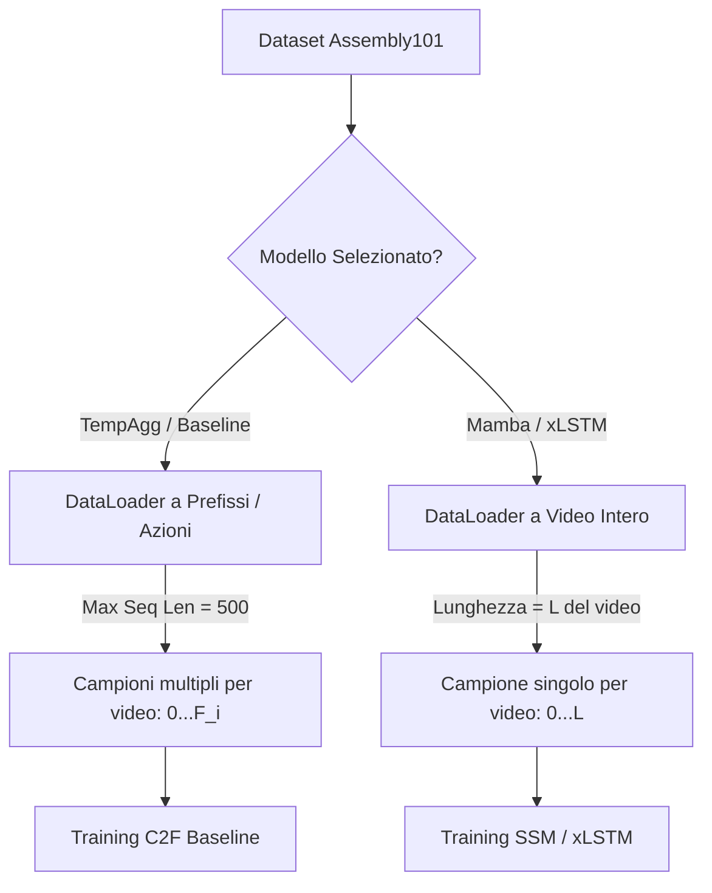

# Proposta Metodologica: Dataloader a Video Intero per Mamba e xLSTM vs Baseline TempAgg

---

## 📌 Sintesi della Proposta

Questa proposta mira a risolvere il grave problema di **overfitting** e **instabilità della loss** riscontrato durante l'addestramento del modello Mamba per il task di *Mistake Detection* su *Assembly101*. 

La proposta prevede la **differenziazione del Dataloader tra i modelli**:
1.  **Baseline TempAgg:** Continuerà ad utilizzare il dataloader standard basato su campioni di azioni troncate/prefissi (max 500 frame) per via dei limiti fisici di memoria del ROI Pooling e della Cross-Attention.
2.  **Mamba & xLSTM:** Utilizzeranno un nuovo dataloader basato sull'**intero video come singola sequenza di frame etichettati**, sfruttando la loro complessità lineare $O(L)$ per contesti a lungo termine.

Questa scelta non è solo una soluzione tecnica, ma rappresenta la **dimostrazione empirica del vantaggio architetturale** dei modelli allo spazio di stato (SSM) e delle Extended LSTM (xLSTM) rispetto alle architetture basate su pooling temporale e attenzione.

---

## 🔍 1. Analisi del Problema Attuale (Perché Mamba overfitta?)

Nel setup corrente, il dataset genera un campione per ciascuna azione annotata in un video (righe del CSV). Per ogni azione che termina al frame $F_i$, il dataloader estrae la storia completa dal frame $0$ al frame $F_i$.

Questo approccio causa tre problemi principali:
1.  **Ridondanza dei Dati e Bias dei Prefissi:** Se un video ha $N$ azioni, la porzione iniziale del video $[0, F_1]$ viene processata e inclusa nella loss $N$ volte in una singola epoca. Questo forte sbilanciamento fa sì che Mamba (che è un modello causale) impari a memorizzare la "firma iniziale" di ogni video di train per indovinare a memoria dove avvengono i mistake, azzerando la loss di train (0.017) ma fallendo completamente su video non visti in validazione (loss a 4.062).
2.  **Moltiplicazione Inutile dei Calcoli:** Eseguire $N$ passi in avanti su prefissi sovrapposti dello stesso video comporta un costo computazionale enorme e ridondante sul cluster.
3.  **Instabilità dei Gradienti:** Lo sbilanciamento delle classi (con la classe `correction` pesata a ~38.5 nella loss per compensare la sua rarità al 6.7%) amplifica a dismisura l'effetto di ogni minimo errore di validazione del modello su video non visti, facendo esplodere la validation loss.

---

## 💡 2. La Soluzione: Dataloader Differenziati

Sfruttando le caratteristiche uniche dei modelli analizzati, proponiamo la seguente architettura per il caricamento dei dati:

### A. TempAgg (Baseline) — Approccio Standard a Prefissi
*   **Perché:** Il modulo `SpanningPastBlock` esegue ROI Pooling della storia temporale ad ogni istante $t$ per $S$ scale, generando tensori di attivazione di forma $[B, T, S, D]$. Per video interi molto lunghi ($T > 2000$), questo modulo causa Out Of Memory (OOM) in GPU o colli di bottiglia computazionali molto pesanti.
*   **Configurazione:** Manteniamo il limite di `--max_seq_len 500` con campioni ritagliati per azione.

### B. Mamba & xLSTM — Approccio a Video Intero
*   **Perché:** Entrambe le architetture hanno una complessità computazionale e di memoria lineare $O(L)$ rispetto alla lunghezza della sequenza. Possono elaborare una timeline continua di migliaia di frame senza alcuna perdita di efficienza o esplosione di memoria.
*   **Configurazione:** Ogni campione nel dataset rappresenterà un singolo video completo. Le feature saranno di dimensione $[L, 2048]$ e le etichette $[L]$, dove $L$ è la lunghezza complessiva del video.

---

## 📈 3. Vantaggi Scientifici e Presentazione al Docente

Presentare questo sdoppiamento della pipeline offre un forte valore accademico:

*   **Evidenza dei Vantaggi Teorici:** Dimostra concretamente che SSM e xLSTM superano il collo di bottiglia della memoria dei Transformer e delle baselines temporali a pooling. I modelli non hanno più bisogno di "finestre d'azione" artificiali ma possono analizzare il flusso video continuo.
*   **Eliminazione del Bias temporale:** Rimuovendo i campioni sovrapposti, eliminiamo il problema del "fingerprinting" dei video. Ogni frame viene visto una sola volta per epoca, costringendo il modello a trovare pattern semantici reali dei *mistakes* per abbassare la loss.
*   **Efficienza Energetica e Temporale:** Il numero di iterazioni per epoca sui modelli Mamba e xLSTM diminuirà drasticamente (pari al numero di video invece del numero totale di azioni). Questo si traduce in addestramenti fino a **15-20 volte più veloci** sul cluster.
*   **Allineamento con la fase di Inference:** Durante il test, il modello deve valutare il video in modalità "online" dall'inizio alla fine. Addestrarlo sull'intero video garantisce che lo stato nascosto $h(t)$ impari a mantenere le informazioni utili lungo tutta la timeline del video reale.

---

## 🛠️ 4. Dettagli di Implementazione ed Iperparametri

Per implementare con successo questa scelta sul cluster, adotteremo le seguenti accortezze tecniche:

1.  **Dataloader Dedicato:** Implementeremo una classe `WholeVideoDataset` che mappa `sequence_name` direttamente sul file `.pt` e legge le etichette cumulative per tutti i frame dal CSV, anziché iterare sulle singole righe delle azioni.
2.  **Limite di Sicurezza Temporale (`--max_seq_len` a 5000/7000):** Nonostante la complessità lineare, per evitare che singoli video "outlier" eccezionalmente lunghi rallentino il training o costringano a un padding eccessivo nei batch, applicheremo un tetto massimo a **5000 o 7000 frame**. La logica di troncamento (già integrata in [dataloader.py](file:///c:/Users/ClaudioNunci/Documents/State-Space-Models-Mamba-for-Mistake-Detection-Deep-Learning-AMM/src/datasets/dataloader.py#L127)) conserverà i frame più recenti, preservando il contesto causale dell'azione.
3.  **Bucketing / Grouped Batching:** Poiché i video hanno durate variabili, per evitare che video corti ricevano troppo padding (inutilizzato) all'interno di batch contenenti video molto lunghi, utilizzeremo un sampler che raggruppa nei batch i video con lunghezze simili.
4.  **Gradient Checkpointing:** Per Mamba e xLSTM, se la VRAM del cluster dovesse saturare su video estremamente lunghi, attiveremo l'opzione di *Gradient Checkpointing* presente in PyTorch e nelle librerie native (`mamba-ssm`), che ricalcola le attivazioni del forward pass durante il backward pass salvando fino all'80% di memoria GPU.
5.  **Regolarizzazione delle Feature:** Aggiungeremo uno strato di `nn.Dropout(0.2)` all'ingresso della proiezione lineare (`input_proj`) di Mamba per introdurre del rumore costruttivo sui vettori TSM pre-estratti, rendendo la memorizzazione statica ancora più difficile.

